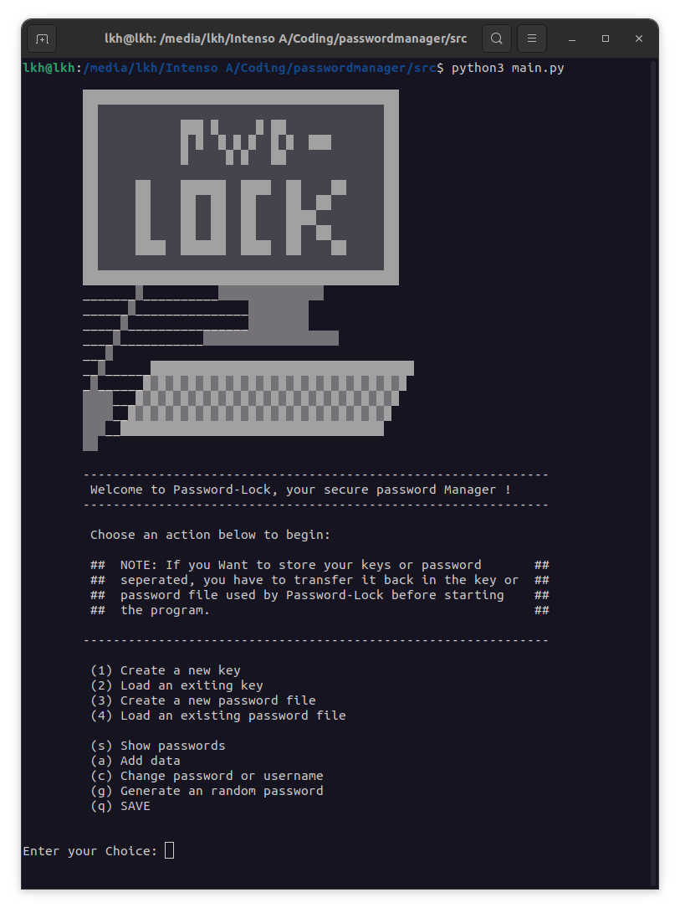
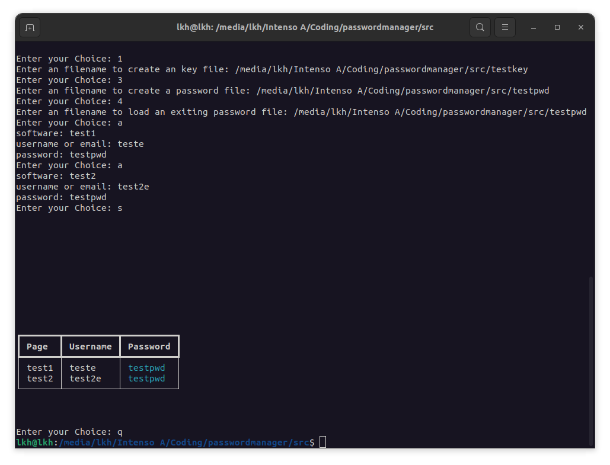

# passwordlocker
Password-Locker is an small project to store your passwords save.
It's an commandline usersafe password manager and one of my first projects.

## libarys used
- random
- string
- base64
- cryptography.fernet
- rich

## first usage
- First generate an key and password file
- Then load the password file
- Add data to the password file
- You can show the data in the process
- Dont forget to save the data with (q)

## usage after
- load key and password file
- show or add data
